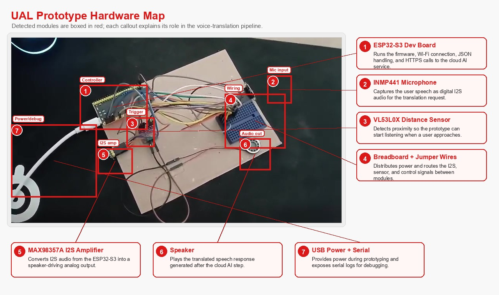
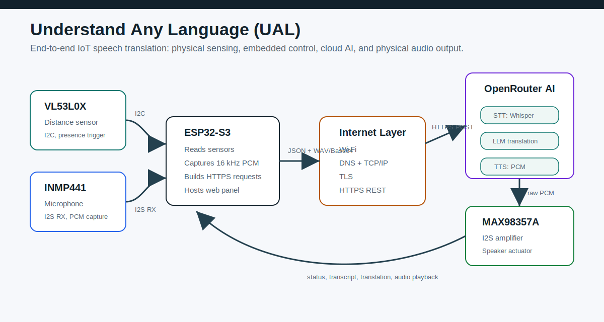
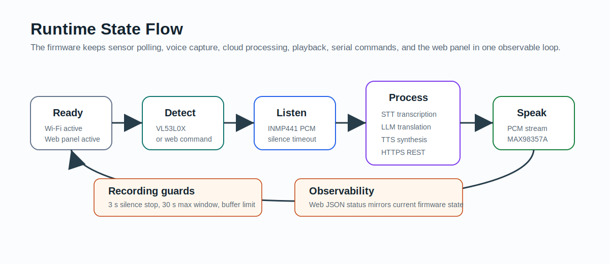
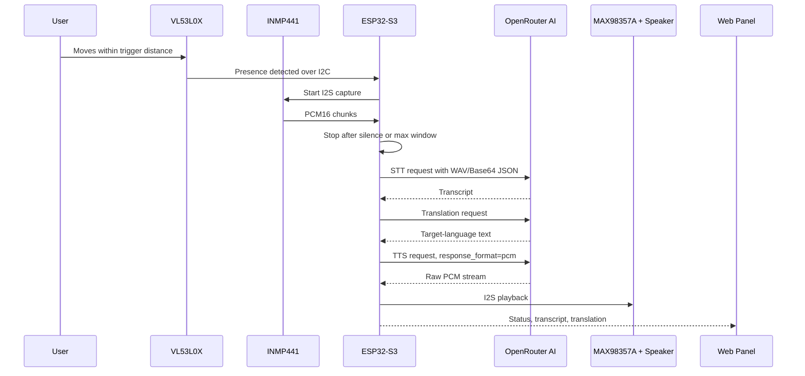

# Understand Any Language (UAL)

[](https://platformio.org/)


[](LICENSE)

UAL is an ESP32-S3 IoT prototype that listens to nearby speech, translates it through a cloud AI pipeline, and plays the translated result through a speaker. It combines physical sensing, embedded audio capture, HTTPS API calls, and a local web control panel in one observable device.

The project was built for an Internet of Things course, but the architecture is intentionally practical: a distance sensor decides when interaction should start, a microphone captures PCM audio, ESP32-S3 sends the audio to OpenRouter, and a MAX98357A I2S amplifier turns the translated TTS stream back into sound.

## Prototype Demo






## What It Does

- Detects a nearby user with the VL53L0X time-of-flight distance sensor.
- Captures speech from an INMP441 I2S microphone as 16 kHz mono PCM16.
- Wraps the PCM recording in a WAV header and sends it to OpenRouter STT.
- Translates the transcript with an OpenRouter chat completion model.
- Requests TTS audio from OpenRouter as raw PCM.
- Streams translated speech to a MAX98357A I2S amplifier and speaker.
- Exposes a browser-based control panel for status, settings, recording, and conversation history.
- Supports serial commands for setup, diagnostics, and manual operation.

## Architecture

UAL is structured as a closed IoT loop:

```text
physical presence + speech
        |
VL53L0X + INMP441
        |
ESP32-S3 firmware
        |
Wi-Fi / DNS / TCP-IP / TLS / HTTPS REST
        |
OpenRouter: STT -> translation LLM -> TTS
        |
MAX98357A + speaker
        |
physical audio output
```

The firmware keeps the embedded responsibilities separated:

| Layer | Component | Responsibility |
| --- | --- | --- |
| Sensing | VL53L0X | Detects proximity and presence thresholds. |
| Audio input | INMP441 | Streams microphone samples over I2S RX. |
| Control | ESP32-S3 | Manages state, buffers PCM, hosts web panel, sends HTTPS requests. |
| Network | Wi-Fi + HTTPS | Moves JSON, WAV/Base64, and PCM data to and from OpenRouter. |
| Cloud AI | OpenRouter | Runs STT, translation, and TTS models. |
| Actuator | MAX98357A + speaker | Converts I2S PCM playback into audible output. |

## Runtime Flow



The normal device loop is:

1. **Ready**: Wi-Fi, serial console, sensors, speaker, and the web panel are available.
2. **Detect**: VL53L0X checks distance every 150 ms. Presence triggers at 1000 mm or less and clears above 1200 mm.
3. **Listen**: INMP441 samples audio through I2S. The firmware stores 16 kHz mono PCM16 in a fixed buffer.
4. **Stop recording**: recording ends after 3 seconds of silence, 30 seconds max duration, or buffer capacity.
5. **Process**: ESP32-S3 sends the recording to OpenRouter STT, translates the transcript, then requests TTS.
6. **Speak**: raw PCM audio is streamed to the MAX98357A amplifier over I2S.
7. **Ready again**: the last transcript and translation remain visible in the web panel.



## Hardware

Target board:

- ESP32-S3 DevKitM-1
- Arduino framework through PlatformIO
- PSRAM enabled with `qio_opi` / `opi`
- 16 MB flash partition configuration

Wiring used by the firmware:

| Module | Signal | ESP32-S3 pin |
| --- | --- | --- |
| VL53L0X | SDA | GPIO8 |
| VL53L0X | SCL | GPIO9 |
| INMP441 | SCK | GPIO12 |
| INMP441 | WS | GPIO13 |
| INMP441 | SD | GPIO14 |
| INMP441 | L/R | GND |
| MAX98357A | BCLK | GPIO15 |
| MAX98357A | LRC | GPIO16 |
| MAX98357A | DIN | GPIO17 |
| MAX98357A | SD | 3V3 |
| MAX98357A | GAIN | GND for higher volume, leave floating if distortion occurs |

## Cloud AI Pipeline

Default models are defined in [`src/config/FirmwareConfig.h`](src/config/FirmwareConfig.h):

| Task | Default model | Output |
| --- | --- | --- |
| STT | `openai/whisper-large-v3` | Transcript text |
| Translation | `mistralai/mistral-small-2603` | Target-language text |
| TTS | `openai/gpt-4o-mini-tts-2025-12-15` | Raw PCM audio |

The firmware uses three OpenRouter endpoints:

| Endpoint | Purpose |
| --- | --- |
| `/api/v1/audio/transcriptions` | Speech-to-text request with WAV/Base64 JSON |
| `/api/v1/chat/completions` | Translation request with system and user messages |
| `/api/v1/audio/speech` | Text-to-speech request with `response_format: pcm` |

## Web Control Panel

The ESP32 serves a browser UI on port `80`. The panel shows:

- Wi-Fi connection, IP, RSSI, DNS mode, and heap.
- Recording, processing, and playback state.
- Distance sensor, microphone, and speaker readiness.
- Last transcript and last translation.
- Voice chat screen with local browser conversation history.
- Settings for Wi-Fi, DNS, OpenRouter API key, language pair, models, TTS voice, TTS sample rate, speed, playback volume, and automatic presence triggering.

The panel talks to these local firmware endpoints:

| Route | Method | Description |
| --- | --- | --- |
| `/` | GET | Control panel HTML |
| `/api/languages` | GET | Supported source and target language lists |
| `/api/status` | GET | Runtime, settings, audio, and memory status |
| `/api/settings` | POST | Saves settings to ESP32 NVS Preferences |
| `/api/command` | POST | Runs a serial-compatible command |
| `/api/restart` | POST | Schedules device restart |
| `/api/clear` | POST | Clears saved settings and restarts |

## Serial Commands

The same commands can be used from the serial monitor or the web terminal:

| Command | Description |
| --- | --- |
| `ssid <WiFi name>` | Save Wi-Fi SSID. |
| `pass <WiFi password>` | Save Wi-Fi password. |
| `wifi <ssid> <password>` | Save SSID and password in one command. |
| `dns <primary> <secondary>` | Set manual DNS, for example `dns 1.1.1.1 8.8.8.8`. |
| `dns auto` | Use DHCP DNS. |
| `orip <OpenRouter IPv4>` | Use an OpenRouter IP fallback if DNS fails. |
| `orip clear` | Disable OpenRouter IP fallback. |
| `apikey <OpenRouter sk-or-...>` | Save OpenRouter API key. |
| `lang <source> <target>` | Save language pair, for example `lang en tr` or `lang auto tr`. |
| `sttmodel <OpenRouter model>` | Override STT model. |
| `transmodel <OpenRouter model>` | Override translation model. |
| `ttsmodel <OpenRouter model>` | Override TTS model. |
| `voice <TTS voice>` | Set TTS voice. |
| `ttsrate <8000-48000>` | Set TTS PCM sample rate. Default is `24000`. |
| `ttsspeed <0.25-4.0>` | Set TTS speed. Default is `1.0`. |
| `volume <0.1-12.0>` | Set playback gain. Default is `4.0`. |
| <code>presence on&#124;off</code> | Enable or disable automatic presence triggering. |
| `r` | Start recording manually. |
| `show` | Print current settings and runtime status. |
| `clear` | Delete saved settings. |
| `restart` | Restart the device. |

## Build and Upload

This is a PlatformIO project. Install PlatformIO, then run:

```bash
pio run
pio run -t upload
pio device monitor
```

Required libraries are declared in [`platformio.ini`](platformio.ini):

- `adafruit/Adafruit_VL53L0X@1.2.5`
- `bblanchon/ArduinoJson@7.4.3`

After flashing, configure Wi-Fi and OpenRouter credentials with the serial monitor or the web panel. Do not commit real credentials; they are runtime settings stored in ESP32 NVS.

## Presentation

The project includes an English PDF presentation at [`presentation/presentation.pdf`](presentation/presentation.pdf). It is generated by:

```bash
python presentation/generate_slides.py
```

The same script also writes [`presentation/speaker_notes.md`](presentation/speaker_notes.md).

## Security Notes

- The OpenRouter API key and Wi-Fi password are not hardcoded; they are entered through serial/web setup and saved in NVS.
- The repository ignores `.env`, `.env.*`, PlatformIO build output, binary firmware artefacts, local VS Code generated files, Python caches, logs, and common secret file names.
- The web panel currently has no authentication. Use it on a trusted local network.
- The prototype currently uses `WiFiClientSecure::setInsecure()` for HTTPS connection setup. For production use, add certificate verification.
- Voice data is sent to a cloud provider. Treat recorded speech as sensitive data and disclose that behavior to users.

## License

This project is licensed under the MIT License. See [`LICENSE`](LICENSE) for details.

## Repository Layout

```text
.
|-- LICENSE
|-- docs/
|   |-- architecture.svg
|   |-- prototype-annotated.jpg
|   |-- prototype-15s.jpg
|   `-- runtime-flow.svg
|-- include/
|-- lib/
|-- presentation/
|   |-- generate_slides.py
|   |-- presentation.pdf
|   `-- speaker_notes.md
|-- src/
|   |-- config/FirmwareConfig.h
|   |-- domain/RuntimeTypes.h
|   |-- i18n/SupportedLanguages.*
|   |-- io/DiagnosticConsole.h
|   |-- web/ControlPanelPage.*
|   `-- main.cpp
|-- test/
|-- platformio.ini
`-- README.md
```

## Pre-Push Checklist

Before pushing to `mo-tunn/UAL`, check:

- `.env` remains ignored and does not contain committed secrets.
- `.pio/` is ignored and not staged.
- No generated firmware binaries such as `.bin`, `.elf`, `.map`, `.hex`, or `.uf2` are staged.
- VS Code generated files such as `c_cpp_properties.json` and `launch.json` are ignored.
- The README visuals under `docs/` are staged because they are documentation assets.
- `presentation/presentation.pdf` is intentionally included only if you want the presentation visible in the repository.

## Authors

- Yavuz Selim Yılmaz
- Metehan Kızılcık
